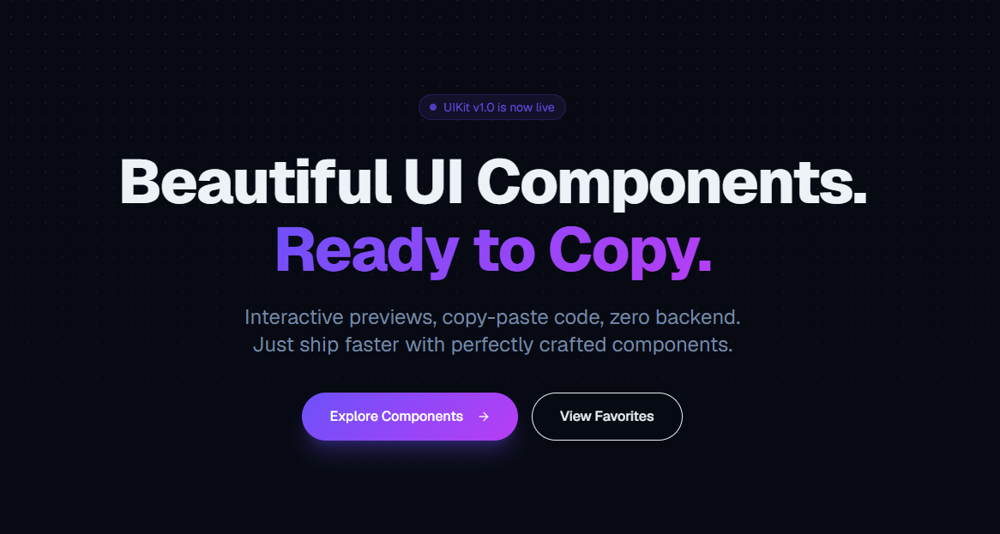

> ***Beautiful UI Components. Ready to Copy ⚡***

<div align="center">
  
</div>

UIKIT is a modern UI component platform that provides developers with beautifully crafted, copy-paste-ready components for building faster and better interfaces.

Instead of wasting hours designing from scratch, developers can simply:

* Browse components
* Preview them live
* Copy the code
* Paste into their project
* Customize however they want

No complicated setup.
No backend required.
Just clean UI components ready to use.

---

##  Features

*  Copy-paste ready UI components
*  Beautiful modern interface
*  Production-ready code
*  Fully responsive components
*  Add to favorites 
*  Browse by categories
*  Interactive live previews
*  One-click copy functionality
*  Developer-friendly structure
*  Free to use

---

##  Tech Stack

### Frontend

* Next.js
* TypeScript
* Tailwind CSS

### Deployment

* Vercel

---

##  Getting Started

### Clone the Repository

```bash
git clone https://github.com/yourusername/uikit.git
```

### Navigate to the Project

```bash
cd uikit
```

### Install Dependencies

```bash
npm install
```

### Run Development Server

```bash
npm run dev
```

Open:

```bash
http://localhost:3000
```

---

##  How To Use Components

1. Visit the live site: [UIKit](https://uikit.vercel.app/) 
2. Browse the component collection
3. Open a component preview
4. Click the **Copy Code** button
5. Paste the code into your project
6. Customize it however you want

Example:

```jsx
import Navbar from "@/components/Navbar";

export default function Home() {
  return (
    <div>
      <Navbar />
    </div>
  );
}
```

---

##  Perfect For

* Landing Pages
* SaaS Applications
* Portfolio Websites
* Dashboards
* Startup Projects
* Personal Projects
* Modern Web Apps

---

##  Contributing

> This project is currently under development.

Contribution guidelines, issue templates, and component contribution workflows will be added soon.

Stay tuned.

---

##  Project Structure

```bash
uikit/
│
├── app/
├── components/
│   ├── ui/
│   ├── cards/
│   ├── buttons/
│   ├── navbars/
│   └── layouts/
│
├── public/
├── lib/
├── styles/
└── utils/
```

---

##  License

This project is licensed under the MIT License.

---

##  Built By

* GitHub: [@akshat-jp](https://github.com/akshat-jp) 
* Twitter/X: [@akshat_jp](https://x.com/akshat_jp) 

---

> ***DO THE HARD WORK SPECIALLY WHEN YOU DON'T FEEL LIKE IT ❤️***
